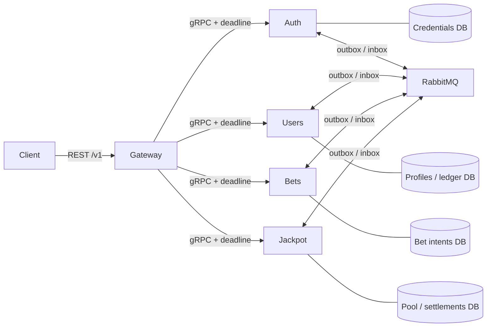
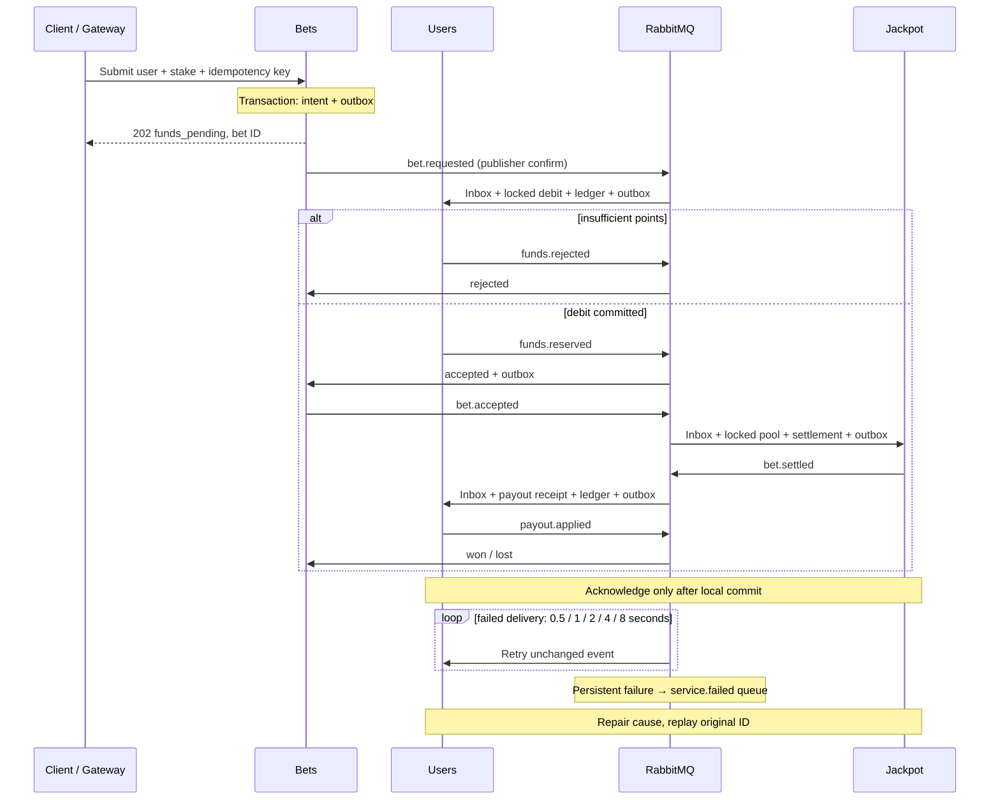

# Jackpot: a distributed points simulator

Originally implemented in May 2022 as a hiring assessment. The original commit history is preserved; the current version adds production-oriented reliability, security, observability, and concurrency hardening.

An API gateway and four services make one small problem concrete: **debit a stake, update a shared pool, and credit a winner despite concurrent requests, retries, and outages.**

**Synthetic points only. Educational / portfolio reference, not real money.** This software lacks the legal, compliance, security, and independently verified fairness controls required for money or regulated gaming. No payment integration or frontend is included.

## The two versions

- **2022 implementation:** annotated tag `original-2022-submission`, commit `261982a4acae77faf9aa72d28f86d0b6857c9693` (May 10).
- **Starting default branch:** `1789b56222b134c4f2e464feb7076f1d14c040e5` (October 13 README update).
- **2026 hardening:** new commits on `codex/2026-hardening`. History and authorship are retained. [Original diagram and sanitized Postman collection](docs/original-2022/README.md) are explicitly historical.

## Run it

Requirements: Node.js 24 LTS, npm, Docker Engine with Compose. The first build downloads pinned images.

```sh
npm ci
npm run setup
docker compose up --build -d --wait --wait-timeout 180
npm run demo
```

`setup` creates an ignored, mode-0600 `.env` with independent random credentials and preserves existing secrets. Services apply committed migrations before readiness. No fixed startup sleeps or watch processes are used.

The API is at [localhost:3000](http://localhost:3000), with [OpenAPI](http://localhost:3000/docs). If that port is occupied, set `GATEWAY_PORT=3300` in `.env`; the demo reads it automatically. The verification environment uses port **3300**.

The demo explicitly creates a local admin, registers a normal user, authenticates, credits **1000** synthetic points, submits a **100**-point stake twice with one idempotency key, waits for settlement and inspects the ledger. Expected: one bet ID, one debit, `lost` or `won`, and final balance `900 + payout`. Output contains correlation and bet IDs, never passwords or tokens. Tests inject fixed winning/losing outcomes.

Stop without deleting data: `docker compose down`.

**Destructive reset:** `docker compose down --volumes` deletes this project's database and broker data. Keep `.env` for the lifetime of its volumes; changing environment passwords does not rotate stored credentials.

## Stack and layout

Node 24 / TypeScript 5.9 / NestJS 12 / gRPC and canonical protobuf / PostgreSQL 17 / TypeORM 0.3 with explicit SQL transactions / RabbitMQ 4.3 quorum queues / OpenTelemetry OTLP / Prometheus metrics.

```text
apps/                    gateway, auth, users, bets, jackpot
packages/contracts/      protobuf, generated types, events, errors, points
packages/config/         validated runtime configuration
packages/runtime/        transactions, outbox/inbox, broker, health, startup
packages/observability/  structured logging and tracing
packages/testing/        real PostgreSQL/RabbitMQ test fixtures
scripts/                 setup, admin bootstrap, demo, failure replay, scans
infrastructure/          local database/broker configuration
tests/                   unit, contracts, integration, e2e, resilience
docs/adr/                decisions; original-2022/ holds historical artifacts
```

One npm workspace and lockfile replace five dependency trees. `npm run contracts:check` verifies protobuf lint and reproducible generation. Service-specific domain tables are never shared.



| Service | Owns                                                                        |
| ------- | --------------------------------------------------------------------------- |
| Auth    | Password hashes, pending/active identities, token issuance and verification |
| Users   | Profile, authoritative role, balance, ledger, debit and payout receipts     |
| Bets    | Scoped idempotency and `funds_pending → accepted → won/lost`, or `rejected` |
| Jackpot | Pool, round, audited random decision and settlement intent                  |
| Gateway | HTTP validation, authentication/authorization, status mapping and OpenAPI   |

Auth ↔ Users and Bets ↔ Jackpot synchronous dependency cycles are removed. Only the gateway makes synchronous domain RPC calls. Registration is also durable: `identity.registered → profile.created → active`. Login can briefly return `FAILED_PRECONDITION` during provisioning.

## Exact points and settlement

Values use PostgreSQL `BIGINT`, TypeScript `bigint`, and validated canonical decimal strings in JSON/protobuf. Positive commands range from `"1"` to `"9223372036854775807"`; accumulated balances and pools must also fit. No unsafe JavaScript `number` conversion participates in value calculations.

Each accepted stake contributes `stake / 10n`, rounded down. The remainder is burned. A uniform cryptographic draw in `[0,99]` wins at zero; the winner receives the whole pool **including their contribution**. The pool resets to zero and the round advances. A stake below 10 can produce a zero-point win. This intentionally simplifies the [original threshold and manual-withdrawal rule](docs/adr/0004-simulator-and-migration.md).



### Tested invariants

- `(user_id, idempotency_key)` identifies one immutable stake; different payload reuse conflicts.
- Row locks prevent overspend and lost pool updates under concurrency.
- State, ledger and outbox changes commit in one local transaction.
- Inbox IDs reject changed content; business references prevent duplicate effects even with a new event ID.
- A loss creates no payout. Winning pool reset and payout intent commit together. A unique payout receipt prevents a second credit.
- Ledger entries are append-only; their sum matches the cached balance in concurrency tests.
- Outbox retries use capped backoff. Consumer failures have bounded retries and an inspectable failed queue. Delivery is **at least once**, with idempotent database effects.

There is no distributed transaction. Downstream failure can leave an accepted debit pending. Automatic timeout refunds could race an already-decided payout, so the implementation retains pending state and supports repair/replay. See [recovery operations](docs/architecture.md#replay-after-repair) and [trust boundaries](docs/security.md). It does not guarantee every command succeeds.

## API and identity

Registration accepts only email/password and provisions role `user`. Admin creation is an explicit operator command. Passwords use salted asynchronous scrypt. Access tokens last 15 minutes and validate issuer, audience and algorithm. Privileged actions query the current Users role; there is no refresh-token subsystem.

| Route                                                  | Purpose                                                   |
| ------------------------------------------------------ | --------------------------------------------------------- |
| `POST /v1/auth/register`, `POST /v1/auth/login`        | Register / authenticate                                   |
| `GET /v1/users/me`, `GET /v1/users/me/ledger?cursor=…` | Own profile and paginated ledger                          |
| `POST /v1/bets`                                        | `{ "amount": "100" }`, bearer token and `Idempotency-Key` |
| `GET /v1/bets/:id`                                     | Own bet and eventual outcome                              |
| `GET /v1/pool`                                         | Current pool                                              |
| `POST /v1/admin/users/:id/credits`                     | Admin-only idempotent synthetic credit                    |

Bodies reject unknown properties and are limited to 16 KiB. GET routes have no bodies. Authentication has a bounded per-process IP limit. Logs exclude bodies/passwords/tokens. Internal RPC requires a generated service token and uses 3-second deadlines. Compose exposes only the gateway on loopback.

## Verification

```sh
npm run format:check
npm run lint
npm run typecheck
npm run build
npm test
npm run contracts:check
npm run test:contracts
npm run contracts:breaking
npm run test:integration
npm run test:e2e
npm run test:resilience
npm run scan:secrets
npm run scan:gitleaks
npm audit --audit-level=high
```

Unit tests exercise identity, roles, arithmetic, transitions, config and HTTP errors. Contract tests serialize large points through actual protobuf. Integration/E2E suites use disposable real PostgreSQL/RabbitMQ and prove migrations, concurrency, idempotency, rollback and redelivery. Resilience tests cover exhausted retries, replay, restarts and dependency outages. Cleanup targets only containers created by each fixture.

[Verification evidence](docs/verification.md) records actual commands, counts, baseline failures and limitations. CI includes verification and Compose/demo jobs. No scale numbers are claimed.

## Observability

Every service has `/live`, `/ready` and `/metrics`; dependency failure changes readiness while liveness remains healthy. Gateway readiness checks downstream services. JSON logs carry service, correlation and event IDs. Metrics cover HTTP/gRPC errors, durations, outbox backlog and consumer failures/age; identifiers are not metric labels.

For local traces, set `OTEL_EXPORTER_OTLP_ENDPOINT=http://jaeger:4318` in `.env`:

```sh
docker compose --profile tracing up -d --wait
npm run demo
```

Open [Jaeger](http://localhost:16686), select a `jackpot-*` service and inspect correlation IDs. W3C trace context crosses HTTP, gRPC and outbox events. The optional backend has no durable trace retention.

## Tradeoffs and what this demonstrates

The code demonstrates service-owned data, explicit asynchronous transitions, atomic state/event publication, layered idempotency, concurrency-safe accounting and failure recovery using real dependencies. Original commits separately demonstrate the manually built 2022 system.

Local single-node PostgreSQL/RabbitMQ are not HA. The global pool row deliberately serializes settlement. Internal plaintext transport and a shared service token require replacement before crossing trust boundaries. Randomness is recorded, **not provably fair**. Outbox/inbox/ledger retention and backup drills remain future work. New schemas and `/v1` APIs intentionally break legacy compatibility; truncated historical values cannot be reconstructed automatically.

[ADRs](docs/adr/) explain decisions. [Follow-ups](docs/follow-ups.md) distinguish remaining work from delivered behavior.
