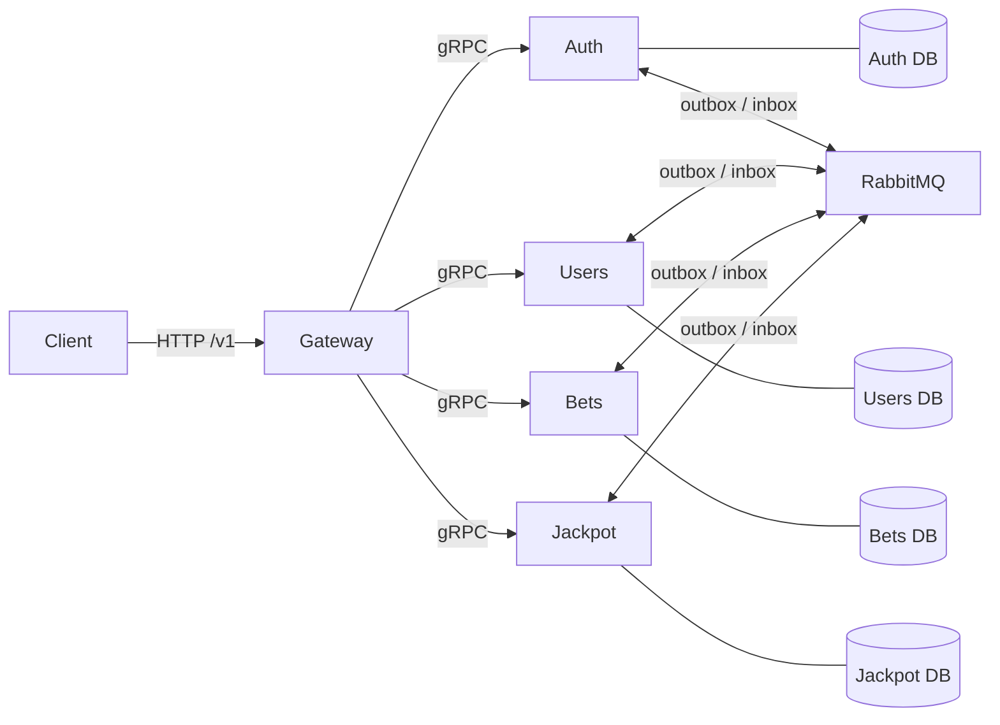
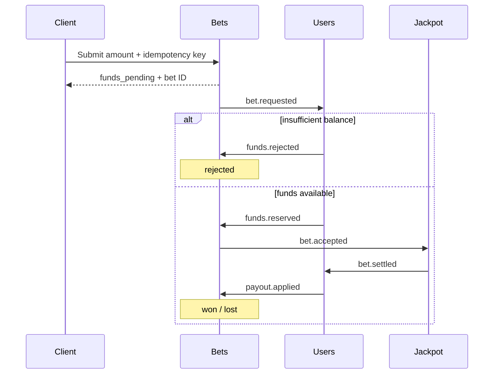

# Architecture and local operations

This repository is a teaching reference for distributed state changes using simulated integer points. It has no payment integration, real-money balance, withdrawal to a bank, or claim of gambling certification.

## Boundaries

| Service | Owns                                                                         | Synchronous API                     |
| ------- | ---------------------------------------------------------------------------- | ----------------------------------- |
| Gateway | HTTP validation, authentication enforcement, authorization, response mapping | Public `/v1`, internal gRPC clients |
| Auth    | Password hashes, identity activation, JWT issuance and verification          | Register, login, verify             |
| Users   | Profiles, roles, point balances, immutable ledger records                    | Own profile/ledger, admin credit    |
| Bets    | Scoped request idempotency and bet lifecycle                                 | Submit bet, get own bet             |
| Jackpot | Pool, rounds, audited draws and settlement decisions                         | Current pool                        |

Each domain service has its own PostgreSQL database and login role. Local Compose uses one PostgreSQL instance for resource economy; its roles cannot connect to the other domain databases. Services share technical runtime, contracts and telemetry packages, not domain entities or tables. The gateway has no database credentials. The explicit administrator bootstrap is an operator tool with access to Auth and Users databases; it does not run on service startup.



Internal gRPC requests carry a service token and have deadlines. Compose exposes only the gateway on `127.0.0.1:3000`; database, broker, management and gRPC ports stay within its network. This local setup uses plaintext internal transport and a shared service token; deployments crossing a trust boundary need TLS, separate service identities and managed secrets.

## Ledger pagination

`GET /v1/users/me/ledger` returns at most 100 entries in immutable sequence order, plus `nextCursor`. An empty `nextCursor` ends the result; otherwise request `/v1/users/me/ledger?cursor=<nextCursor>`. Cursors are canonical nonnegative decimal strings within PostgreSQL's signed BIGINT range. Keep them as strings. The endpoint rejects malformed cursors, duplicate cursor parameters and unsupported query fields. Pagination stays within the authenticated user's ledger, and a page stays below the internal gRPC response size limit.

## Registration

Auth validates and hashes credentials, records a pending identity and publishes `identity.registered` through its transactional outbox. Users creates the profile with role `user` and zero points, then emits `profile.created`. Auth activates the identity. Login during this interval returns a precondition error; callers may retry within a bounded deadline. Supplying an administrator role in registration is rejected. JWT identity alone never establishes administrator privileges: authorization reads the current Users role.

## A bet from request to completion



Every arrow between domain services is a durable broker event. A database transaction commits a state change and its outbox entry together. Publisher confirms permit marking an outbox entry as sent, while consumer acknowledgements happen after the inbox transaction commits. A publish/commit crash can redeliver: inbox event IDs and independent business reference uniqueness protect the ledger and settlement against duplicates. This provides idempotent effects with at-least-once delivery, not universal exactly-once transport.

`packages/contracts/src/events.ts` defines all eight events as one discriminated contract: each `type` selects its strict payload schema, and every envelope requires `schemaVersion: 1`. `Transaction.emit` correlates event names and payloads at compile time and validates the complete envelope before writing the outbox. The publisher and consumer validate the same contract again; invalid deliveries cannot enter the inbox or reach domain handlers and follow the existing retry/failed-queue path. Service handlers reuse the canonical payload schemas. The `subscriptions` map in `packages/runtime/src/bus.ts` is the sole source for queue bindings and consumer admission.

Missing or unsupported schema versions are rejected, never silently upgraded. Before upgrading a development stack that has unversioned pending events, drain its old workflow with the old services or deliberately start with fresh disposable data. Replaying an unversioned message against v1 consumers will park it again; changing an already-processed event's contents under the same ID violates inbox deduplication.

Point amounts use canonical decimal strings at API boundaries and PostgreSQL `BIGINT` internally. No floating-point arithmetic participates in balances or payouts. Account row locks serialize competing debits; pool row locks serialize settlement decisions. Reusing one user's idempotency key with a different amount is rejected. Each debit has a unique `debit:<betId>` ledger reference; each winning credit has a unique `payout:<betId>` reference.

The simulator contributes `floor(stake / 10)` points to the pool. A cryptographic uniform draw in `[0, 99]` wins only at zero. The winner receives the whole pool after their own contribution, the pool resets, and the round advances. Payout happens automatically. This rule intentionally replaces the original 2022 threshold rule; see [ADR 0004](adr/0004-simulator-and-migration.md).

A downstream outage may leave a debit associated with a pending bet. An automatic timeout refund could pay both a refund and an already-decided jackpot, so the workflow retains durable pending state for recovery. Retries and replay must preserve the original event identity and business references. Review dead-letter records and correlate ledger, bet and settlement records before any manual repair.

### Replay after repair

After correcting the cause of parked deliveries, replay a bounded snapshot for the affected service:

```sh
docker compose exec -T users npm run replay:failures -- users
```

Use `auth`, `bets` or `jackpot` in both service positions for their own failed queues. The tool preserves each original event ID, resets retry attempts, confirms republishing to the original queue and only then acknowledges the parked delivery. A crash can duplicate a replay, so inbox and business-key deduplication remain necessary. Replaying an unchanged poison message only parks it again; inspect and repair first.

## Start and inspect

```sh
npm ci
npm run setup
docker compose build gateway
docker compose up -d --wait --wait-timeout 180
npm run demo
```

Setup creates `.env` with independent 256-bit random values and mode `0600`; subsequent calls preserve it. Keep that file with its local database volumes. Changing environment passwords alone does not change PostgreSQL roles or RabbitMQ users already stored in volumes. Credentials never belong in source control. `.env.example` lists empty secret fields deliberately.

Startup applies each service's migrations before readiness. Migration work and dependency connection are bounded by startup failures and health checks; Compose waits for actual healthy dependencies instead of sleeping a fixed number of seconds. Each application offers `/live`, `/ready` and `/metrics` on internal HTTP port 3000. The gateway also exposes `/docs` for OpenAPI. A live process can be unready while dependencies recover.

```sh
docker compose ps
curl --fail http://127.0.0.1:3000/live
curl --fail http://127.0.0.1:3000/ready
curl --fail http://127.0.0.1:3000/metrics
```

The demo explicitly bootstraps a local administrator from generated credentials, registers a fresh regular user, waits for profile activation, credits simulated points through the authorized API, submits a bet twice with the same idempotency key, waits for settlement and checks the balance and single debit. It prints IDs and point results, never credentials or JWTs. It does not require a random win to succeed.

### Metrics

Bets exposes `bet_outcomes{state=...}`, a gauge collected from committed database rows for all five states, including zero-valued states. `bet_settlement_latency_seconds{statistic="mean"|"max"}` describes elapsed time from bet creation to its final `won`/`lost` state over retained rows. Rejected and pending bets are excluded from latency. These values survive process restarts and duplicate deliveries because they are recomputed from durable state; querying them scans retained bet history.

Broker runtime metrics have different meanings: `settlement_deliveries_total` counts successful `payout.applied` deliveries, including inbox-deduplicated repeats; `event_processing_seconds` times a single handler; `consumer_event_age_seconds` is the age of the latest handled event. They are operational signals, not distinct settlement counts or financial accounting. Use the append-only ledger and settlement receipts to reconcile points. A zero-point winning settlement has a receipt and final outcome, but creates no zero-value ledger credit.

### Tracing

Set `OTEL_EXPORTER_OTLP_ENDPOINT=http://jaeger:4318` in `.env`, then run:

```sh
docker compose --profile tracing up -d --wait --wait-timeout 180
npm run demo
```

Open [local Jaeger](http://127.0.0.1:16686). The optional single-process Jaeger uses ephemeral storage and is for local inspection. Trace context and correlation IDs connect requests and asynchronous handlers; telemetry must not contain passwords, tokens or request bodies.

### Stop and reset

`docker compose down` stops the stack while preserving its volumes. `docker compose down --volumes` permanently deletes local points, identities, ledger and queued events; use it only when deliberately resetting this disposable environment. Do not attach existing 2022 database volumes to this stack.

## Operational limits

This one-node PostgreSQL/one-node RabbitMQ environment is not highly available. A quorum queue on one node supplies its queue semantics, not node-failure redundancy. There is no backup/restore automation, multi-region coordination, fraud detection, regulatory approval, production secret manager, rate-limit service or independent financial reconciliation. Database migrations target an empty new schema. Existing 2022 data requires a separately designed export, validation and reconciliation process.

The verification record distinguishes executed checks from outstanding checks: [verification](verification.md).
